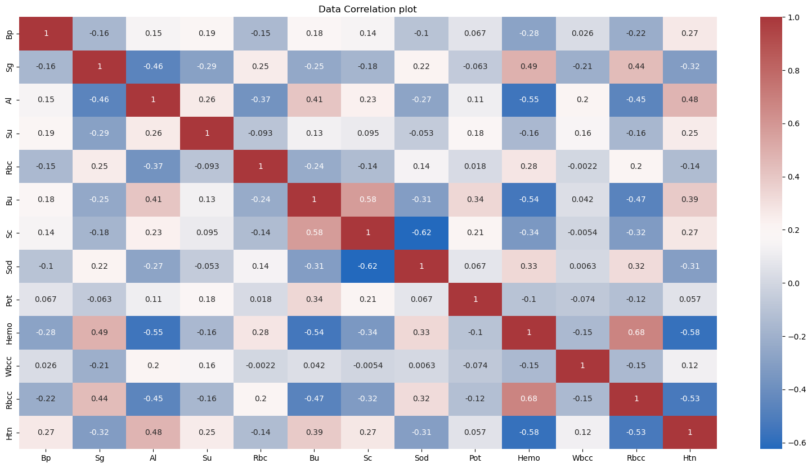

# Chronic Kidney Disease :
---

- **To build a Machine Learning model to accurately predict whether or not the patients in the dataset have chronic disease or not**

- Dataset Source : [🔗kaggle.com](https://www.kaggle.com/datasets/abhia1999/chronic-kidney-disease)

- Here, I have used Random Forest Classifier and achieved >98% of accuracy.


```python
import numpy as np
import pandas as pd

import os 
#for dirname, _, filenames in os.walk('/kaggle/input'):
#    for filename in filenames:
#        print(os.path.join(dirname, filename))
```


```python
import seaborn as sns
import matplotlib.pyplot as plt 
```


```python
db = pd.read_csv('./dataset/new_model.csv')
db.head(5)
```


<div>
<style scoped>
    .dataframe tbody tr th:only-of-type {
        vertical-align: middle;
    }

    .dataframe tbody tr th {
        vertical-align: top;
    }

    .dataframe thead th {
        text-align: right;
    }
</style>
<table border="1" class="dataframe">
  <thead>
    <tr style="text-align: right;">
      <th></th>
      <th>Bp</th>
      <th>Sg</th>
      <th>Al</th>
      <th>Su</th>
      <th>Rbc</th>
      <th>Bu</th>
      <th>Sc</th>
      <th>Sod</th>
      <th>Pot</th>
      <th>Hemo</th>
      <th>Wbcc</th>
      <th>Rbcc</th>
      <th>Htn</th>
      <th>Class</th>
    </tr>
  </thead>
  <tbody>
    <tr>
      <th>0</th>
      <td>80.0</td>
      <td>1.020</td>
      <td>1.0</td>
      <td>0.0</td>
      <td>1.0</td>
      <td>36.0</td>
      <td>1.2</td>
      <td>137.53</td>
      <td>4.63</td>
      <td>15.4</td>
      <td>7800.0</td>
      <td>5.20</td>
      <td>1.0</td>
      <td>1</td>
    </tr>
    <tr>
      <th>1</th>
      <td>50.0</td>
      <td>1.020</td>
      <td>4.0</td>
      <td>0.0</td>
      <td>1.0</td>
      <td>18.0</td>
      <td>0.8</td>
      <td>137.53</td>
      <td>4.63</td>
      <td>11.3</td>
      <td>6000.0</td>
      <td>4.71</td>
      <td>0.0</td>
      <td>1</td>
    </tr>
    <tr>
      <th>2</th>
      <td>80.0</td>
      <td>1.010</td>
      <td>2.0</td>
      <td>3.0</td>
      <td>1.0</td>
      <td>53.0</td>
      <td>1.8</td>
      <td>137.53</td>
      <td>4.63</td>
      <td>9.6</td>
      <td>7500.0</td>
      <td>4.71</td>
      <td>0.0</td>
      <td>1</td>
    </tr>
    <tr>
      <th>3</th>
      <td>70.0</td>
      <td>1.005</td>
      <td>4.0</td>
      <td>0.0</td>
      <td>1.0</td>
      <td>56.0</td>
      <td>3.8</td>
      <td>111.00</td>
      <td>2.50</td>
      <td>11.2</td>
      <td>6700.0</td>
      <td>3.90</td>
      <td>1.0</td>
      <td>1</td>
    </tr>
    <tr>
      <th>4</th>
      <td>80.0</td>
      <td>1.010</td>
      <td>2.0</td>
      <td>0.0</td>
      <td>1.0</td>
      <td>26.0</td>
      <td>1.4</td>
      <td>137.53</td>
      <td>4.63</td>
      <td>11.6</td>
      <td>7300.0</td>
      <td>4.60</td>
      <td>0.0</td>
      <td>1</td>
    </tr>
  </tbody>
</table>
</div>


```python
print(db.info(), '\nShape:', db.shape)
```

    <class 'pandas.core.frame.DataFrame'>
    RangeIndex: 400 entries, 0 to 399
    Data columns (total 14 columns):
     #   Column  Non-Null Count  Dtype  
    ---  ------  --------------  -----  
     0   Bp      400 non-null    float64
     1   Sg      400 non-null    float64
     2   Al      400 non-null    float64
     3   Su      400 non-null    float64
     4   Rbc     400 non-null    float64
     5   Bu      400 non-null    float64
     6   Sc      400 non-null    float64
     7   Sod     400 non-null    float64
     8   Pot     400 non-null    float64
     9   Hemo    400 non-null    float64
     10  Wbcc    400 non-null    float64
     11  Rbcc    400 non-null    float64
     12  Htn     400 non-null    float64
     13  Class   400 non-null    int64  
    dtypes: float64(13), int64(1)
    memory usage: 43.9 KB
    None 
    Shape: (400, 14)
    


```python
db.describe()
```


<div>
<style scoped>
    .dataframe tbody tr th:only-of-type {
        vertical-align: middle;
    }

    .dataframe tbody tr th {
        vertical-align: top;
    }

    .dataframe thead th {
        text-align: right;
    }
</style>
<table border="1" class="dataframe">
  <thead>
    <tr style="text-align: right;">
      <th></th>
      <th>Bp</th>
      <th>Sg</th>
      <th>Al</th>
      <th>Su</th>
      <th>Rbc</th>
      <th>Bu</th>
      <th>Sc</th>
      <th>Sod</th>
      <th>Pot</th>
      <th>Hemo</th>
      <th>Wbcc</th>
      <th>Rbcc</th>
      <th>Htn</th>
      <th>Class</th>
    </tr>
  </thead>
  <tbody>
    <tr>
      <th>count</th>
      <td>400.000000</td>
      <td>400.000000</td>
      <td>400.000000</td>
      <td>400.000000</td>
      <td>400.000000</td>
      <td>400.00000</td>
      <td>400.00000</td>
      <td>400.000000</td>
      <td>400.000000</td>
      <td>400.000000</td>
      <td>400.000000</td>
      <td>400.000000</td>
      <td>400.000000</td>
      <td>400.000000</td>
    </tr>
    <tr>
      <th>mean</th>
      <td>76.455000</td>
      <td>1.017712</td>
      <td>1.015000</td>
      <td>0.395000</td>
      <td>0.882500</td>
      <td>57.40550</td>
      <td>3.07235</td>
      <td>137.529025</td>
      <td>4.627850</td>
      <td>12.526900</td>
      <td>8406.090000</td>
      <td>4.708275</td>
      <td>0.369350</td>
      <td>0.625000</td>
    </tr>
    <tr>
      <th>std</th>
      <td>13.476536</td>
      <td>0.005434</td>
      <td>1.272329</td>
      <td>1.040038</td>
      <td>0.322418</td>
      <td>49.28597</td>
      <td>5.61749</td>
      <td>9.204273</td>
      <td>2.819783</td>
      <td>2.716171</td>
      <td>2523.219976</td>
      <td>0.840315</td>
      <td>0.482023</td>
      <td>0.484729</td>
    </tr>
    <tr>
      <th>min</th>
      <td>50.000000</td>
      <td>1.005000</td>
      <td>0.000000</td>
      <td>0.000000</td>
      <td>0.000000</td>
      <td>1.50000</td>
      <td>0.40000</td>
      <td>4.500000</td>
      <td>2.500000</td>
      <td>3.100000</td>
      <td>2200.000000</td>
      <td>2.100000</td>
      <td>0.000000</td>
      <td>0.000000</td>
    </tr>
    <tr>
      <th>25%</th>
      <td>70.000000</td>
      <td>1.015000</td>
      <td>0.000000</td>
      <td>0.000000</td>
      <td>1.000000</td>
      <td>27.00000</td>
      <td>0.90000</td>
      <td>135.000000</td>
      <td>4.000000</td>
      <td>10.875000</td>
      <td>6975.000000</td>
      <td>4.500000</td>
      <td>0.000000</td>
      <td>0.000000</td>
    </tr>
    <tr>
      <th>50%</th>
      <td>78.000000</td>
      <td>1.020000</td>
      <td>1.000000</td>
      <td>0.000000</td>
      <td>1.000000</td>
      <td>44.00000</td>
      <td>1.40000</td>
      <td>137.530000</td>
      <td>4.630000</td>
      <td>12.530000</td>
      <td>8406.000000</td>
      <td>4.710000</td>
      <td>0.000000</td>
      <td>1.000000</td>
    </tr>
    <tr>
      <th>75%</th>
      <td>80.000000</td>
      <td>1.020000</td>
      <td>2.000000</td>
      <td>0.000000</td>
      <td>1.000000</td>
      <td>61.75000</td>
      <td>3.07000</td>
      <td>141.000000</td>
      <td>4.800000</td>
      <td>14.625000</td>
      <td>9400.000000</td>
      <td>5.100000</td>
      <td>1.000000</td>
      <td>1.000000</td>
    </tr>
    <tr>
      <th>max</th>
      <td>180.000000</td>
      <td>1.025000</td>
      <td>5.000000</td>
      <td>5.000000</td>
      <td>1.000000</td>
      <td>391.00000</td>
      <td>76.00000</td>
      <td>163.000000</td>
      <td>47.000000</td>
      <td>17.800000</td>
      <td>26400.000000</td>
      <td>8.000000</td>
      <td>1.000000</td>
      <td>1.000000</td>
    </tr>
  </tbody>
</table>
</div>


```python
# Removing final class and keep rest features together

include_features = db.drop(db.columns[-1], axis=1)
# include_features

fig = plt.figure(figsize=(20,10))
sns.heatmap(include_features.corr(), annot = True, cmap='vlag')
plt.title("Data Correlation plot")
plt.show()
```


    

    


```python
# Class value counts

db['Class'].value_counts()
```


    1    250
    0    150
    Name: Class, dtype: int64


## Splitting into Test and Train


```python
from sklearn.model_selection import train_test_split

X = db.drop(['Class'], axis=1)
# X
Y = db['Class']
# Y

X_train, X_test, Y_train, Y_test = train_test_split(X, Y, test_size=0.4, random_state=3)

print(X_train.shape, X_test.shape)
```

    (240, 13) (160, 13)
    

---
## Random Forest Classification:


```python
from sklearn.ensemble import RandomForestClassifier

model = RandomForestClassifier()
model.fit(X_train, Y_train)
```


    RandomForestClassifier()


```python
model.score(X_test, Y_test)*100
```


    98.125


```python
#Predictions

y_predictions = model.predict(X_test)
y_predictions
```


    array([0, 1, 0, 1, 1, 1, 0, 1, 0, 1, 0, 1, 0, 1, 1, 1, 1, 1, 0, 0, 1, 1,
           1, 1, 1, 1, 0, 1, 0, 1, 0, 1, 0, 1, 1, 1, 1, 1, 1, 1, 0, 1, 1, 1,
           0, 0, 1, 0, 1, 1, 1, 1, 1, 1, 1, 0, 1, 0, 1, 0, 1, 0, 0, 1, 1, 0,
           1, 0, 1, 0, 1, 0, 1, 1, 0, 1, 1, 1, 1, 1, 1, 1, 1, 1, 0, 1, 1, 1,
           0, 1, 1, 1, 1, 0, 0, 1, 1, 0, 0, 1, 1, 1, 1, 1, 0, 1, 1, 0, 1, 1,
           1, 0, 1, 1, 1, 1, 1, 1, 1, 1, 1, 1, 0, 1, 0, 1, 1, 1, 0, 0, 1, 0,
           1, 1, 1, 1, 1, 1, 1, 1, 1, 1, 1, 0, 1, 0, 1, 1, 1, 0, 1, 1, 1, 0,
           0, 1, 0, 1, 1, 1], dtype=int64)


```python
model.score(X_test, Y_test)*100

```


    98.125


```python
from sklearn.metrics import classification_report, confusion_matrix

print(classification_report(Y_test, y_predictions))
```

                  precision    recall  f1-score   support
    
               0       1.00      0.94      0.97        49
               1       0.97      1.00      0.99       111
    
        accuracy                           0.98       160
       macro avg       0.99      0.97      0.98       160
    weighted avg       0.98      0.98      0.98       160
    
    


```python
print(confusion_matrix(Y_test, y_predictions))
```

    [[ 46   3]
     [  0 111]]
    

---
